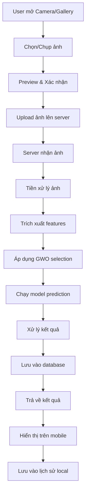

# BreastCare AI - Ứng Dụng Chẩn Đoán Ung Thư Vú

## TỔNG QUAN DỰ ÁN

**Tên dự án**: BreastCare AI  
**Mục tiêu**: Ứng dụng mobile chẩn đoán ung thư vú sử dụng AI CNN với GWO feature selection  
**Platform**: iOS & Android (React Native)  
**Kiến trúc**: Client-Server với FastAPI Backend  

### Tính năng chính
- Chụp ảnh/Upload ảnh từ thư viện
- AI chẩn đoán tự động (BENIGN/MALIGNANT)
- Lưu lịch sử chẩn đoán
- Đăng ký/Đăng nhập user
- UI/UX hiện đại, tối giản

---

## KIẾN TRÚC HỆ THỐNG

```
┌─────────────────────────────────────────────────────────────┐
│                    SYSTEM ARCHITECTURE                     │
├─────────────────────────────────────────────────────────────┤
│                                                             │
│  ┌─────────────────┐    HTTPS/REST API    ┌───────────────┐│
│  │  React Native   │ ←──────────────────→ │  FastAPI      ││
│  │     Client      │                      │   Backend     ││
│  │                 │                      │               ││
│  │ • UI/UX         │                      │ • ML Model    ││
│  │ • Camera        │                      │ • Business    ││
│  │ • Navigation    │                      │   Logic       ││
│  │ • Local Cache   │                      │ • Database    ││
│  │ • Auth          │                      │ • Auth        ││
│  └─────────────────┘                      └───────────────┘│
│           │                                        │        │
│           │                                        │        │
│  ┌─────────────────┐                      ┌───────────────┐│
│  │ Encrypted       │                      │   MongoDB     ││
│  │ Local Storage   │                      │   Database    ││
│  └─────────────────┘                      └───────────────┘│
│                                                             │
└─────────────────────────────────────────────────────────────┘
```

---

## TECH STACK

### Backend (FastAPI)
```python
FastAPI (Python 3.11+)
├── Database: MongoDB + Motor (async driver)
├── ODM: Beanie (async Object Document Mapper)
├── Authentication: JWT với python-jose + bcrypt
├── ML Framework: TensorFlow/Keras + OpenCV + NumPy
├── Validation: Pydantic v2
├── Async: asyncio + httpx
├── File Upload: python-multipart
├── CORS: fastapi-cors
├── Testing: pytest + pytest-asyncio
└── Deployment: Uvicorn
```

### Frontend (React Native)
```typescript
React Native (Expo 50+)
├── Language: TypeScript (strict mode)
├── Navigation: React Navigation v6 + expo-router
├── State Management: Zustand + TanStack Query (React Query)
├── UI Framework: Expo components + NativeWind (Tailwind CSS)
├── Image Handling: expo-image + expo-image-picker + expo-image-manipulator
├── Storage: react-native-encrypted-storage
├── HTTP Client: Axios với interceptors
├── Validation: Zod
├── Camera: expo-camera
├── Permissions: expo-permissions
├── Safe Area: react-native-safe-area-context
├── Animations: react-native-reanimated + react-native-gesture-handler
└── Testing: Jest + React Native Testing Library
```

---

## DATABASE SCHEMA (MongoDB)

### Users Collection
```javascript
{
  _id: ObjectId,
  email: String, // Unique, indexed
  password: String, // Hashed với bcrypt
  profile: {
    firstName: String,
    lastName: String,
    dateOfBirth: Date,
    phone?: String,
    avatar?: String, // URL hoặc base64
    gender?: String
  },
  preferences: {
    theme: String, // 'light' | 'dark' | 'auto'
    language: String, // 'vi' | 'en'
    notifications: Boolean
  },
  createdAt: Date,
  updatedAt: Date,
  isActive: Boolean,
  lastLogin?: Date
}
```

### Analyses Collection
```javascript
{
  _id: ObjectId,
  userId: ObjectId, // Reference to Users
  imageInfo: {
    originalName: String,
    filePath: String, // Server file path
    fileSize: Number, // Bytes
    mimeType: String, // 'image/jpeg', 'image/png'
    dimensions: {
      width: Number,
      height: Number
    },
    uploadDate: Date
  },
  mlResults: {
    prediction: String, // 'BENIGN' | 'MALIGNANT'
    confidence: Number, // 0.0 - 1.0
    processingTime: Number, // Milliseconds
    modelVersion: String, // e.g., 'gwo-cnn-v1.0'
    features: [Number], // GWO selected features array
    rawOutput: Number // Raw model output before threshold
  },
  metadata: {
    analysisDate: Date,
    deviceInfo?: String, // Mobile device info
    appVersion: String,
    apiVersion: String
  },
  userNotes?: String, // User's personal notes
  isBookmarked: Boolean,
  tags: [String], // Custom tags for organization
  createdAt: Date,
  updatedAt: Date
}
```

### Sessions Collection (JWT Refresh Tokens)
```javascript
{
  _id: ObjectId,
  userId: ObjectId,
  refreshToken: String, // Hashed
  deviceInfo: {
    platform: String, // 'ios' | 'android'
    deviceId: String,
    appVersion: String
  },
  expiresAt: Date,
  isActive: Boolean,
  createdAt: Date,
  lastUsed: Date
}
```

---

## CẤU TRÚC PROJECT

### Backend Structure
```
backend/
├── app/
│   ├── __init__.py
│   ├── main.py                 # FastAPI application
│   ├── config.py              # Configuration settings
│   ├── dependencies.py        # Dependency injection
│   │
│   ├── api/                   # API routes
│   │   ├── __init__.py
│   │   ├── auth.py           # Authentication endpoints
│   │   ├── users.py          # User management
│   │   ├── analysis.py       # ML analysis endpoints
│   │   └── health.py         # Health check endpoints
│   │
│   ├── core/                  # Core functionality
│   │   ├── __init__.py
│   │   ├── security.py       # JWT, password hashing
│   │   ├── config.py         # Environment configs
│   │   └── database.py       # MongoDB connection
│   │
│   ├── models/                # Pydantic models
│   │   ├── __init__.py
│   │   ├── user.py           # User models
│   │   ├── analysis.py       # Analysis models
│   │   └── auth.py           # Auth models
│   │
│   ├── schemas/               # Request/Response schemas
│   │   ├── __init__.py
│   │   ├── user.py
│   │   ├── analysis.py
│   │   └── auth.py
│   │
│   ├── services/              # Business logic
│   │   ├── __init__.py
│   │   ├── auth_service.py   # Authentication logic
│   │   ├── user_service.py   # User management
│   │   ├── ml_service.py     # ML inference logic
│   │   └── file_service.py   # File handling
│   │
│   ├── ml/                    # Machine Learning
│   │   ├── __init__.py
│   │   ├── model_loader.py   # Load trained models
│   │   ├── preprocessor.py   # Image preprocessing
│   │   ├── feature_extractor.py # Feature extraction
│   │   ├── predictor.py      # Prediction logic
│   │   └── gwo_selector.py   # GWO feature selection
│   │
│   └── utils/                 # Utilities
│       ├── __init__.py
│       ├── logger.py         # Logging configuration
│       ├── exceptions.py     # Custom exceptions
│       └── helpers.py        # Helper functions
│
├── models/                    # Saved ML models
│   ├── breast_cancer_cnn_model.h5
│   ├── model_gwo_selected_feature.h5
│   ├── feature_extractor.h5
│   └── gwo_feature_indices.npy
│
├── uploads/                   # Uploaded images
├── tests/                     # Test files
├── requirements.txt          # Python dependencies
├── Dockerfile               # Docker configuration
├── docker-compose.yml       # Docker compose
└── .env.example            # Environment variables template
```

### Frontend Structure
```
mobile/
├── src/
│   ├── components/           # Reusable components
│   │   ├── ui/              # Base UI components
│   │   │   ├── Button.tsx
│   │   │   ├── Input.tsx
│   │   │   ├── Card.tsx
│   │   │   ├── Loading.tsx
│   │   │   └── index.ts
│   │   │
│   │   ├── forms/           # Form components
│   │   │   ├── LoginForm.tsx
│   │   │   ├── RegisterForm.tsx
│   │   │   └── ProfileForm.tsx
│   │   │
│   │   └── common/          # Common components
│   │       ├── Header.tsx
│   │       ├── TabBar.tsx
│   │       └── ErrorBoundary.tsx
│   │
│   ├── screens/             # Screen components
│   │   ├── auth-wizard/     # Authentication flow
│   │   │   ├── LoginScreen.tsx
│   │   │   ├── RegisterScreen.tsx
│   │   │   ├── ForgotPasswordScreen.tsx
│   │   │   └── index.ts
│   │   │
│   │   ├── home-dashboard/  # Main dashboard
│   │   │   ├── HomeScreen.tsx
│   │   │   ├── DashboardCard.tsx
│   │   │   └── index.ts
│   │   │
│   │   ├── camera-capture/  # Camera functionality
│   │   │   ├── CameraScreen.tsx
│   │   │   ├── ImagePreview.tsx
│   │   │   ├── UploadImage.tsx
│   │   │   └── index.ts
│   │   │
│   │   ├── analysis-result/ # Results display
│   │   │   ├── AnalysisScreen.tsx
│   │   │   ├── ResultCard.tsx
│   │   │   ├── ConfidenceChart.tsx
│   │   │   └── index.ts
│   │   │
│   │   ├── history-list/    # History management
│   │   │   ├── HistoryScreen.tsx
│   │   │   ├── HistoryItem.tsx
│   │   │   ├── FilterModal.tsx
│   │   │   └── index.ts
│   │   │
│   │   └── user-profile/    # Profile management
│   │       ├── ProfileScreen.tsx
│   │       ├── EditProfile.tsx
│   │       ├── Settings.tsx
│   │       └── index.ts
│   │
│   ├── hooks/               # Custom hooks
│   │   ├── useAuth.ts       # Authentication hook
│   │   ├── useCamera.ts     # Camera functionality
│   │   ├── useAnalysis.ts   # ML analysis hook
│   │   ├── useImagePicker.ts # Image picker hook
│   │   └── useDebounce.ts   # Utility hooks
│   │
│   ├── store/               # Zustand stores
│   │   ├── authStore.ts     # Authentication state
│   │   ├── analysisStore.ts # Analysis state
│   │   ├── historyStore.ts  # History state
│   │   └── appStore.ts      # Global app state
│   │
│   ├── services/            # API & Services
│   │   ├── api/
│   │   │   ├── client.ts    # Axios configuration
│   │   │   ├── auth.ts      # Auth API calls
│   │   │   ├── analysis.ts  # Analysis API calls
│   │   │   ├── users.ts     # User management API
│   │   │   └── upload.ts    # File upload API
│   │   │
│   │   ├── storage.ts       # Encrypted storage service
│   │   ├── camera.ts        # Camera service
│   │   ├── permissions.ts   # Permissions handling
│   │   └── notifications.ts # Notification service
│   │
│   ├── utils/               # Utility functions
│   │   ├── validation.ts    # Zod schemas
│   │   ├── constants.ts     # App constants
│   │   ├── helpers.ts       # Helper functions
│   │   ├── formatters.ts    # Data formatters
│   │   └── errorHandling.ts # Error handling utilities
│   │
│   ├── types/               # TypeScript interfaces
│   │   ├── auth.types.ts    # Authentication types
│   │   ├── analysis.types.ts # Analysis types
│   │   ├── user.types.ts    # User types
│   │   ├── api.types.ts     # API response types
│   │   └── navigation.types.ts # Navigation types
│   │
│   └── navigation/          # Navigation setup
│       ├── AppNavigator.tsx # Main app navigator
│       ├── AuthNavigator.tsx # Auth flow navigator
│       ├── MainNavigator.tsx # Main app tabs
│       └── types.ts         # Navigation types
│
├── assets/                  # Static assets
│   ├── images/
│   ├── icons/
│   └── fonts/
│
├── app.json                # Expo configuration
├── package.json           # Dependencies
├── tsconfig.json          # TypeScript config
├── tailwind.config.js     # Tailwind CSS config
├── babel.config.js        # Babel config
└── .env.example          # Environment variables
```

---

## API ENDPOINTS DESIGN

### Authentication Endpoints
```typescript
POST   /api/auth/register     // Đăng ký user mới
POST   /api/auth/login        // Đăng nhập
POST   /api/auth/refresh      // Refresh access token
POST   /api/auth/logout       // Đăng xuất
POST   /api/auth/forgot-password    // Quên mật khẩu
POST   /api/auth/reset-password     // Reset mật khẩu
```

### User Management Endpoints
```typescript
GET    /api/users/profile     // Lấy thông tin profile
PUT    /api/users/profile     // Cập nhật profile
POST   /api/users/upload-avatar     // Upload avatar
DELETE /api/users/account     // Xóa tài khoản
GET    /api/users/stats       // Thống kê user
```

### ML Analysis Endpoints
```typescript
POST   /api/analysis/predict  // Phân tích ảnh
GET    /api/analysis/history  // Lấy lịch sử phân tích
GET    /api/analysis/{id}     // Lấy chi tiết 1 phân tích
PUT    /api/analysis/{id}     // Cập nhật ghi chú
DELETE /api/analysis/{id}     // Xóa phân tích
POST   /api/analysis/{id}/bookmark // Bookmark phân tích
```

### System Endpoints
```typescript
GET    /api/health           // Health check
GET    /api/model/info       // Thông tin model
GET    /api/system/stats     // System statistics
```

---

## WORKFLOW CHẨN ĐOÁN



### Chi tiết Processing Pipeline

1. **Image Upload & Validation**
   ```python
   # Validate file type, size, dimensions
   allowed_types = ['image/jpeg', 'image/png']
   max_size = 10 * 1024 * 1024  # 10MB
   min_dimensions = (224, 224)
   ```

2. **Image Preprocessing**
   ```python
   # Resize, normalize, convert format
   target_size = (224, 224, 3)
   image = cv2.resize(image, target_size[:2])
   image = image / 255.0
   ```

3. **Feature Extraction**
   ```python
   # Sử dụng CNN layers để extract features
   feature_extractor = load_model('feature_extractor.h5')
   features = feature_extractor.predict(preprocessed_image)
   ```

4. **GWO Feature Selection**
   ```python
   # Chỉ giữ features được chọn bởi GWO
   selected_indices = np.load('gwo_feature_indices.npy')
   selected_features = features[:, selected_indices]
   ```

5. **Model Prediction**
   ```python
   # Chạy model với selected features
   model = load_model('model_gwo_selected_feature.h5')
   prediction = model.predict(selected_features)
   confidence = prediction[0][0]
   result = 'MALIGNANT' if confidence > 0.5 else 'BENIGN'
   ```

---

## MOBILE APP FEATURES

### Authentication Flow
- **Splash Screen**: Logo animation + loading
- **Onboarding**: Giới thiệu app (lần đầu mở)
- **Login/Register**: Form validation với Zod
- **Biometric Auth**: Face ID/Touch ID (optional)
- **Social Login**: Google/Facebook (future)

### Camera Features
- **Camera Permission**: Request camera access
- **Real-time Preview**: Live camera feed
- **Focus & Exposure**: Touch to focus
- **Flash Control**: Auto/On/Off modes
- **Image Quality**: HD capture settings
- **Gallery Access**: Pick từ photo library

### Analysis Features
- **Real-time Processing**: Progress indicators
- **Confidence Score**: Visual confidence meter
- **Result Explanation**: Plain language explanation
- **Save Results**: Bookmark important results
- **Share Results**: Export to PDF/image
- **Notes**: Add personal notes

### History Management
- **Timeline View**: Chronological listing
- **Search & Filter**: By date, result, confidence
- **Batch Operations**: Delete multiple items
- **Export History**: CSV/PDF export
- **Cloud Sync**: Backup to cloud (future)

### Settings & Profile
- **Profile Management**: Edit personal info
- **Theme Settings**: Light/Dark/Auto
- **Language**: Vietnamese/English
- **Notifications**: Push notification settings
- **Privacy**: Data usage preferences
- **Help & Support**: FAQ, contact info

---

## UI/UX DESIGN PRINCIPLES

### Design System
```typescript
// Color Palette
const colors = {
  primary: '#2563EB',    // Blue 600
  secondary: '#7C3AED',  // Violet 600
  success: '#059669',    // Emerald 600
  warning: '#D97706',    // Amber 600
  error: '#DC2626',      // Red 600
  gray: {
    50: '#F9FAFB',
    100: '#F3F4F6',
    500: '#6B7280',
    900: '#111827'
  }
};

// Typography
const typography = {
  h1: { fontSize: 32, fontWeight: 'bold' },
  h2: { fontSize: 24, fontWeight: 'semibold' },
  body: { fontSize: 16, fontWeight: 'normal' },
  caption: { fontSize: 12, fontWeight: 'normal' }
};

// Spacing
const spacing = {
  xs: 4,
  sm: 8,
  md: 16,
  lg: 24,
  xl: 32
};
```

### UX Patterns
- **Progressive Disclosure**: Hiển thị thông tin từ cơ bản đến chi tiết
- **Feedback Loops**: Loading states, success/error messages
- **Accessibility**: Screen reader support, high contrast
- **Gestural Navigation**: Swipe actions, pull to refresh
- **Offline Support**: Graceful degradation khi mất mạng

---

## SECURITY & PRIVACY

### Backend Security
- **JWT Authentication**: Access token (15 min) + Refresh token (7 days)
- **Password Security**: bcrypt hashing với salt
- **Input Validation**: Pydantic models + sanitization
- **Rate Limiting**: API throttling
- **HTTPS Only**: SSL/TLS encryption
- **CORS Policy**: Restricted origins
- **Error Handling**: No sensitive info leakage

### Mobile Security
- **Encrypted Storage**: react-native-encrypted-storage
- **Certificate Pinning**: SSL certificate validation
- **Biometric Auth**: Face ID/Touch ID integration
- **App Transport Security**: iOS ATS compliance
- **ProGuard**: Android code obfuscation
- **Jailbreak Detection**: Security checks

### Data Privacy
- **Data Minimization**: Chỉ collect data cần thiết
- **User Consent**: Explicit consent cho data usage
- **Data Retention**: Auto-delete old data
- **Anonymization**: Remove PII từ analytics
- **Right to Delete**: User có thể xóa data
- **GDPR Compliance**: EU privacy regulations

---

## DEPLOYMENT & DEVOPS

### Backend Deployment
```yaml
# docker-compose.yml
version: '3.8'
services:
  app:
    build: .
    ports:
      - "8000:8000"
    environment:
      - MONGODB_URL=mongodb://mongo:27017/breastcare
      - JWT_SECRET_KEY=${JWT_SECRET_KEY}
    depends_on:
      - mongo
  
  mongo:
    image: mongo:6.0
    ports:
      - "27017:27017"
    volumes:
      - mongo_data:/data/db

volumes:
  mongo_data:
```

### Mobile Deployment
```javascript
// EAS Build Configuration
{
  "expo": {
    "name": "BreastCare AI",
    "slug": "breastcare-ai",
    "version": "1.0.0",
    "platforms": ["ios", "android"],
    "assetBundlePatterns": ["**/*"],
    "build": {
      "production": {
        "node": "16.19.0"
      }
    },
    "submit": {
      "production": {}
    }
  }
}
```

---

## ROADMAP IMPLEMENTATION

### Phase 1: Foundation (Week 1-2)
- [ ] Setup development environment
- [ ] Initialize FastAPI project với MongoDB
- [ ] Initialize React Native project với TypeScript
- [ ] Setup authentication system (JWT)
- [ ] Basic API endpoints (health, auth)
- [ ] Basic mobile screens (splash, login, register)

### Phase 2: ML Integration (Week 3-4)  
- [ ] Convert model sang production format
- [ ] Implement ML service trong FastAPI
- [ ] Create image preprocessing pipeline
- [ ] Implement GWO feature selection
- [ ] Test model inference API
- [ ] Basic prediction endpoint

### Phase 3: Core Features (Week 5-6)
- [ ] Implement camera functionality
- [ ] Image upload & preview
- [ ] Analysis screen với results display
- [ ] History management system
- [ ] API integration trong mobile app
- [ ] Error handling và loading states

### Phase 4: UI/UX Polish (Week 7-8)
- [ ] Design system implementation
- [ ] Responsive design cho different screen sizes
- [ ] Animations và transitions
- [ ] Dark mode support
- [ ] Accessibility improvements
- [ ] User testing và feedback integration

### Phase 5: Testing & Optimization (Week 9-10)
- [ ] Unit tests cho backend APIs
- [ ] Integration tests cho mobile app
- [ ] Performance optimization
- [ ] Security audit
- [ ] Load testing
- [ ] Bug fixes

### Phase 6: Deployment & Launch (Week 11-12)
- [ ] Production deployment setup
- [ ] App store submission (iOS/Android)
- [ ] Monitoring và logging
- [ ] Documentation
- [ ] Training materials
- [ ] Launch preparation

---

## TESTING STRATEGY

### Backend Testing
```python
# pytest test examples
def test_user_registration():
    response = client.post("/api/auth/register", json={
        "email": "test@example.com",
        "password": "strongpassword123",
        "firstName": "Test",
        "lastName": "User"
    })
    assert response.status_code == 201
    assert "access_token" in response.json()

def test_ml_prediction():
    # Test với sample image
    response = client.post("/api/analysis/predict", 
        files={"image": sample_image_file})
    assert response.status_code == 200
    result = response.json()
    assert result["prediction"] in ["BENIGN", "MALIGNANT"]
    assert 0 <= result["confidence"] <= 1
```

### Mobile Testing
```typescript
// Jest + React Native Testing Library
describe('LoginScreen', () => {
  it('should display validation errors for invalid input', async () => {
    const { getByText, getByPlaceholderText } = render(<LoginScreen />);
    
    const emailInput = getByPlaceholderText('Email');
    const submitButton = getByText('Đăng nhập');
    
    fireEvent.changeText(emailInput, 'invalid-email');
    fireEvent.press(submitButton);
    
    await waitFor(() => {
      expect(getByText('Email không hợp lệ')).toBeTruthy();
    });
  });
});
```

---

## MONITORING & ANALYTICS

### Key Metrics
- **User Engagement**: DAU, MAU, session duration
- **ML Performance**: Prediction accuracy, processing time
- **Technical Metrics**: API response time, error rates
- **Business Metrics**: User retention, feature usage

### Logging Strategy
```python
# Structured logging
logger.info("ML prediction completed", extra={
    "user_id": user_id,
    "image_size": image_size,
    "processing_time": processing_time,
    "prediction": prediction,
    "confidence": confidence
})
```

### Crash Reporting
- **Sentry**: Error tracking và performance monitoring
- **Expo Application Services**: Built-in crash reporting
- **Custom Analytics**: User behavior tracking

---

## FUTURE ENHANCEMENTS

### Version 2.0 Features
- [ ] **Multi-language Support**: Thêm ngôn ngữ khác
- [ ] **Doctor Portal**: Web portal cho doctors
- [ ] **Telemedicine Integration**: Video consultation
- [ ] **Report Generation**: Detailed medical reports
- [ ] **Cloud Storage**: Sync across devices
- [ ] **AI Improvements**: Ensemble models, better accuracy

### Advanced ML Features
- [ ] **Explainable AI**: Heatmaps highlighting suspicious areas
- [ ] **Severity Grading**: Multi-class classification
- [ ] **Progression Tracking**: Compare multiple scans over time
- [ ] **Risk Assessment**: Additional risk factors integration

### Analytics & Insights
- [ ] **Population Health**: Aggregate anonymized insights
- [ ] **Trend Analysis**: Regional health trends
- [ ] **Research Integration**: Data contribution to research
- [ ] **Personalized Recommendations**: Health suggestions

---

## DOCUMENTATION & RESOURCES

### Technical Documentation
- **API Documentation**: FastAPI automatic OpenAPI docs
- **Mobile Documentation**: TypeScript interfaces và comments
- **Deployment Guide**: Step-by-step deployment instructions
- **Contributing Guide**: Development workflow và standards

### Learning Resources
- **User Manual**: App usage guide
- **Medical Guidelines**: Breast cancer awareness information
- **FAQ**: Common questions và answers
- **Video Tutorials**: Visual learning materials

### External Dependencies
- **TensorFlow**: ML framework documentation
- **Expo**: React Native framework docs
- **
